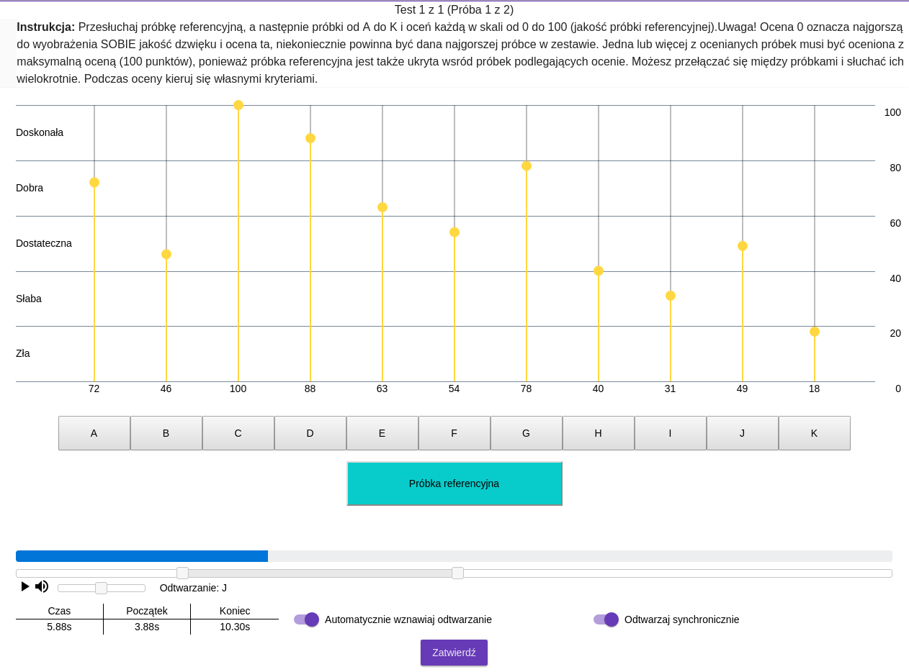
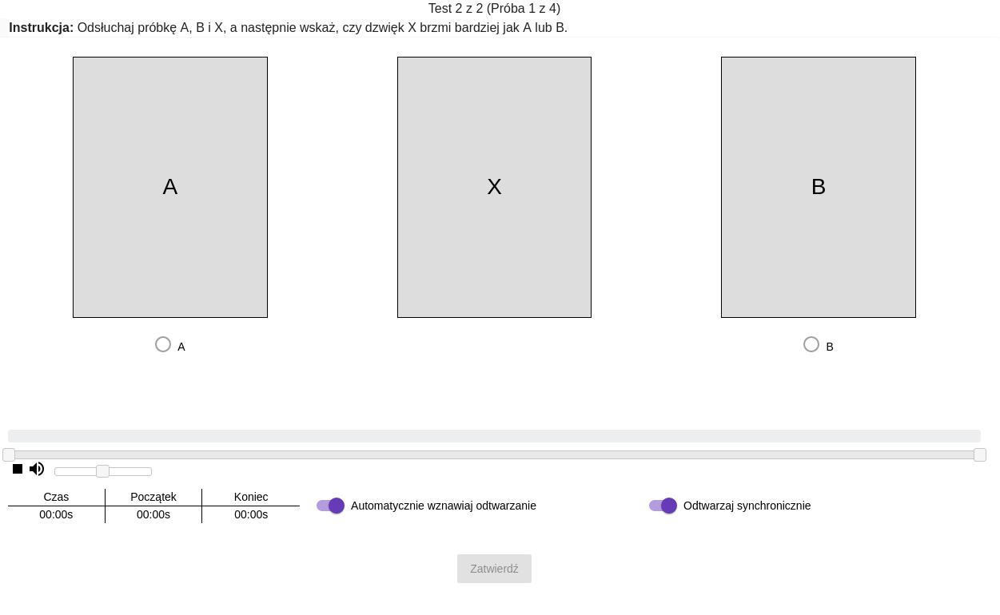
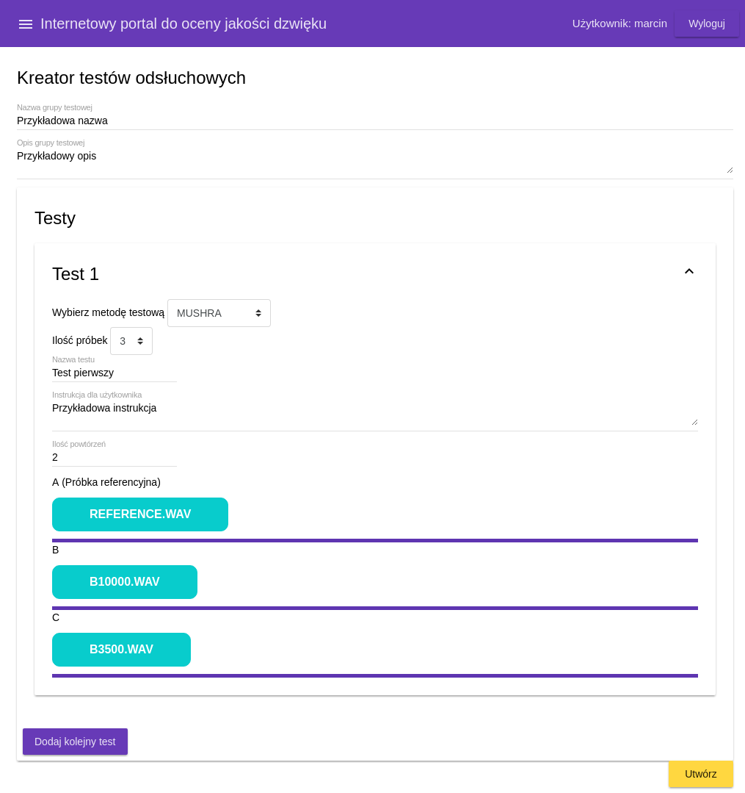
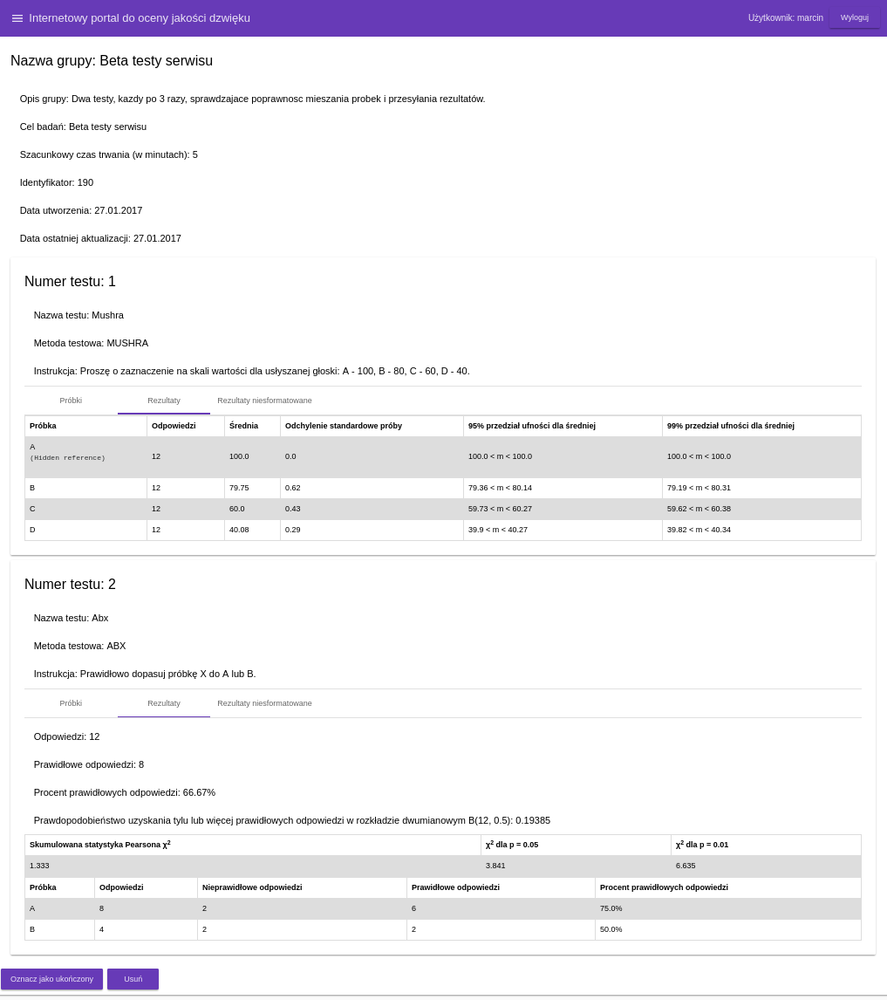
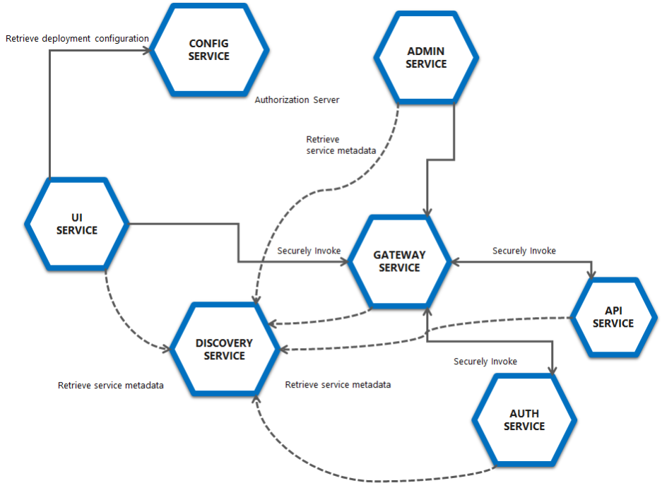

Sound Quality Assessment Portal aggregation repository.

## PROJECT DESCRIPTION:
Internet portal for audio quality assessment. The web-based application enables users to create auditory tests based on the MUSHRA and ABX methods. Application allows to perform remote auditory tests, export obtained results to CSV or JSON files and to perform on demand some basic statistics checks.

## FEATURES:
* Method based on ITU-R BS.1534 (MUSHRA) - linear 60ms crossfade instead of fade-out/in, up to 12 samples can be used

* ABX Test

* Client side processing using Web Audio API
* Database integration, user system
* Graphical test creator allowing to build test scenario

* Possibility to set the number of repetitions for a test
* Export result to CSV/JSON
* Statistics check (means/confidence intervals/Pearson's chi-squared and binomial test)

* Authentication and authorization based on OAuth 2.0

## TODO:
* Polish to English translation of the UI
* Firefox fixes (currently Chromium/Google Chrome recommended)
* ...

## TOOLS:
Spring Boot/Data/Cloud, Hibernate, Angular 2, Zuul

## MICROSERVICES ARCHITECTURE:
Project based on SPRING BOOT ANGULAR 2 STARTER (Tomasz Kucharzyk kucharzyk) https://github.com/kucharzyk/spring-angular2-starter



### RUNNING IN DEVELOPMENT MODE:
Running with Docker TBA.

You should set parameters to your database for API and Auth microservices first. Configuration manual will be announced.

To run:

Execute script:
```
 ./scripts/run-all.py
```

Or install all dependencies at first manual:
```
mvn clean install -P dev-standalone
```
Run config server in development mode:

```
cd sqap-config
mvn spring-boot:run -P dev-standalone
```

Run discovery server in development mode:
```
cd sqap-discovery
mvn spring-boot:run -P dev-standalone
```

Run gateway server in development mode:
```
cd sqap-gateway
mvn spring-boot:run -P dev-standalone
```

Run api server in development mode:
```
cd sqap-api
mvn spring-boot:run -P dev-standalone
```

Run auth server in development mode:
```
cd sqap-auth
mvn spring-boot:run -P dev-standalone
```

Run ui server in development mode:
```
cd sqap-ui
mvn spring-boot:run -P dev-standalone
```

Run admin server (optional) in development mode:
```
cd sqap-admin
mvn spring-boot:run -P dev-standalone
```

Proxies for API calls can be configured in proxy.json file.
Default configuration assumes that your API is running at localhost:8080

### TESTING ANGULAR FRONTEND

Running unit tests:
```
cd sqap-ui
npm run test
```

Running e2e tests:
```
cd sqap-ui
npm run e2e
```
### MORE INFORMATION
* Marcin Milewski, Opracowanie portalu internetowego do oceny jakości dźwięku, Bachelor engineering thesis, Bialystok University of Technology, 2017 (Polish) [pdf](docs/thesis.pdf)
